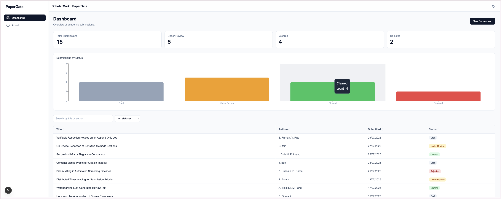

# PaperGate

A demo academic pre-submission dashboard, inspired by the workflow of tools like ScholarMark. Built with Next.js, React, and Tailwind CSS.

## Live Demo

[View live](https://YOUR-VERCEL-URL.vercel.app)

[View live](https://papergate.vercel.app)



## What it does

- **Submissions dashboard** with stat cards, a searchable and sortable table, and status filtering
- **Detail view** for each submission with full abstract and metadata
- **Create submission** form with validation
- **Integrity check**: a rule-based analysis of the abstract (length, methodology, results, readability) served from a Next.js API route
- **Cryptographic seal**: a SHA-256 hash of the abstract with verification, using the Web Crypto API
- **Bar chart** of submissions by status
- **Dark mode** toggle and a fully responsive layout

## Tech stack

- Next.js (App Router) and React
- TypeScript
- Tailwind CSS
- Recharts for the chart
- Next.js API routes for the backend (mock data and the integrity endpoint)

## Running locally

```bash
npm install
npm run dev
```

Open http://localhost:3000.

## Notes

Submission data is served from an in-memory mock via a Next.js API route. New submissions and seals are held in client state for the session and reset on refresh. The integrity check uses transparent rule-based heuristics, not a machine learning model. This is a portfolio project and is not affiliated with any organization.
